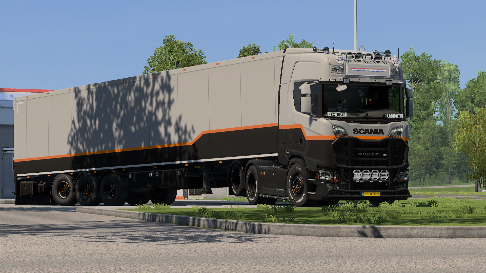

# NextGear Logistics — Universal Paintjob

This paintjob is approved for daily drives, deliveries, and official NextGear Logistics operations across all standard fleet trucks and trailers.

---

## Paintjob: Sade

> **Type:** Base Game Free  
> **Applicable To:** All Trucks & Universal Trailers

### Paint Specifications

| Attribute | Details |
| :--- | :--- |
| **In-Game Name** | Sade |
| **Required DLC** | None |

### Color Palette

**HEX Codes**
* **Color 1 :** `#919191` *(Broken White)*
* **Color 2 :** `#282828` *(Deep Charcoal)*
* **Color 3 :** `#F37A00` *(NextGear Orange)*

**RGB Codes**
* **Color 1 :** `145, 145, 145` *(Broken White)*
* **Color 2 :** `40, 40, 40` *(Deep Charcoal)*
* **Color 3 :** `243, 122, 0` *(NextGear Orange)*


**Important:** Ensure the color slots in the workshop match the exact order listed above to maintain the official NextGear design.

